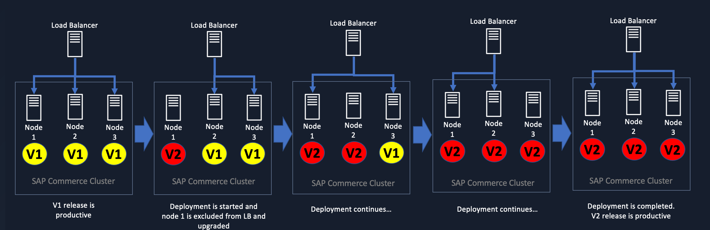
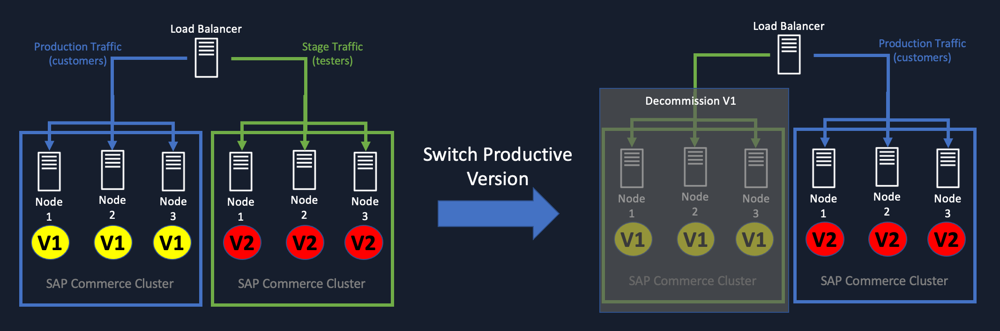
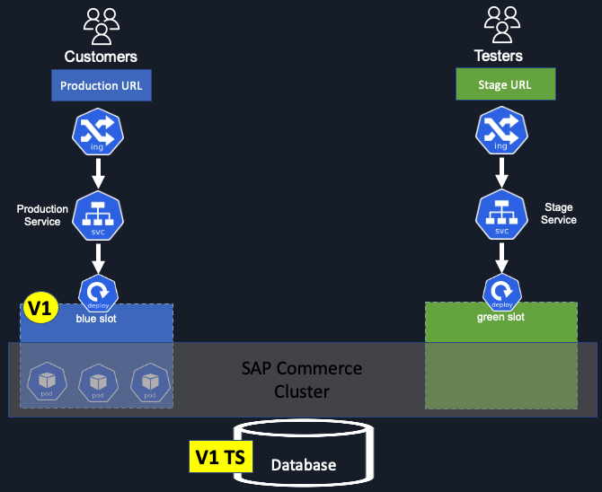
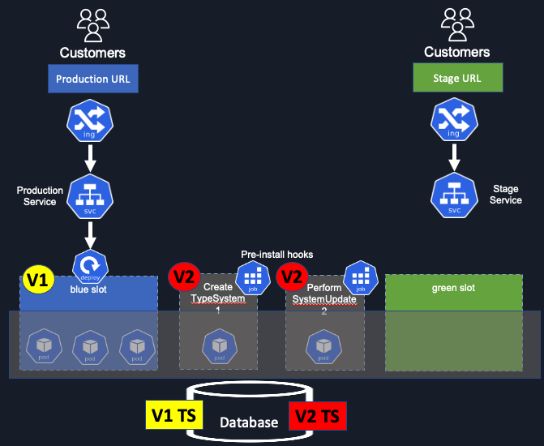
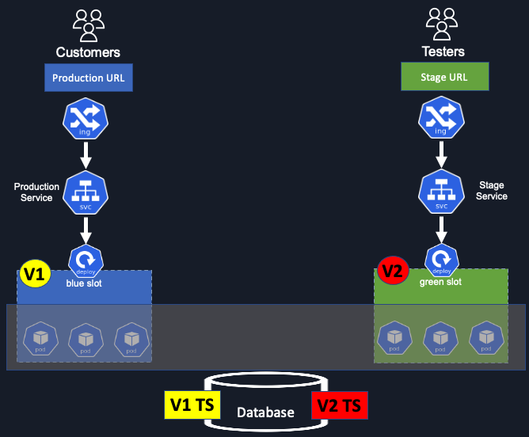
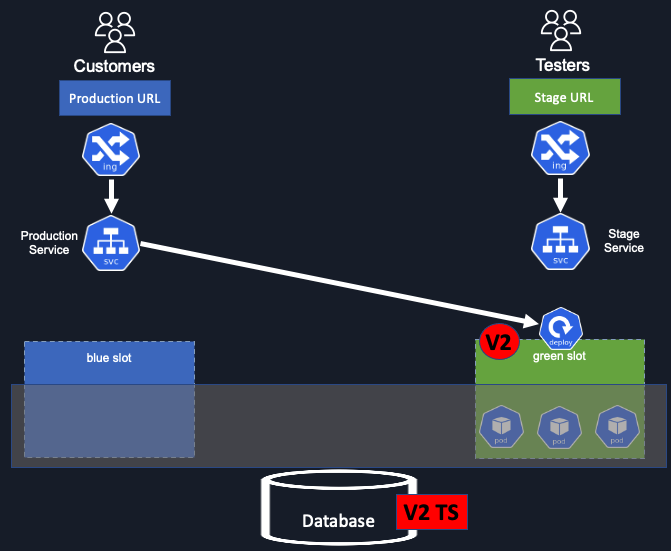
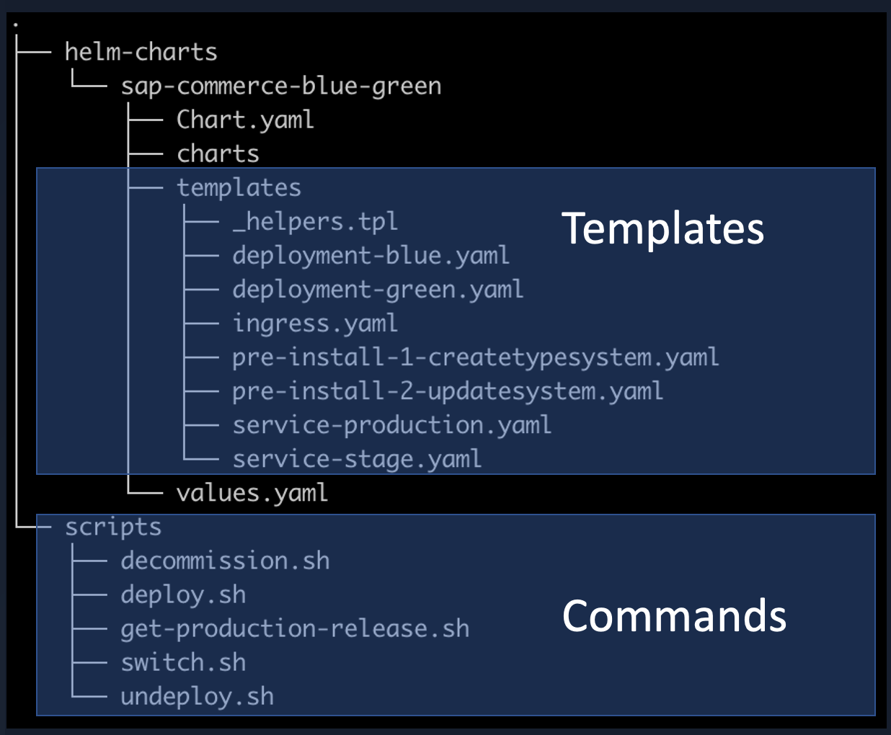
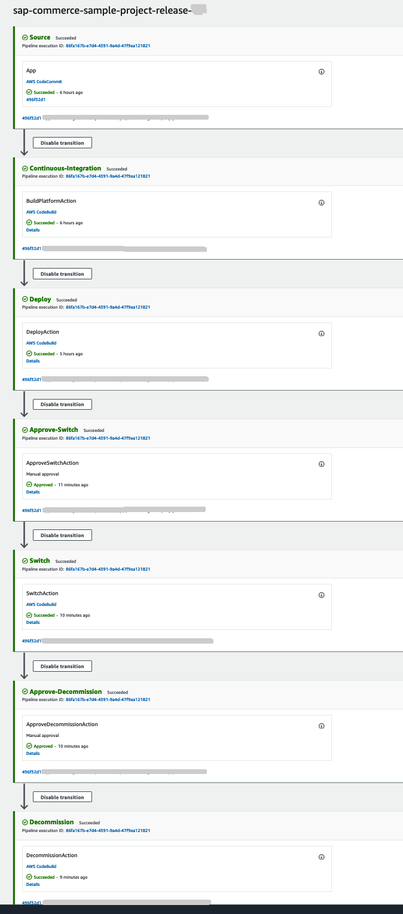

# Blue/Green deployments for SAP Commerce applications on AWS EKS

## Introduction

This document describes the most common issues that customers are experiencing in on-premise [SAP Commerce](https://help.sap.com/viewer/product/SAP_COMMERCE/latest/en-US) deployments and gives a concrete way to achieve [blue/green deployments](https://docs.aws.amazon.com/whitepapers/latest/blue-green-deployments/introduction.html) on [Amazon Elastic Kubernetes Service](https://aws.amazon.com/eks/) in order to have faster and more secure deployments of SAP Commerce applications.

The deployment procedure is based on what is described in the SAP official documentation regarding[performing rolling update on the cluster](https://help.sap.com/viewer/d0224eca81e249cb821f2cdf45a82ace/2105/en-US/8c455268866910149b25f7b53d1af3e1.html).

In this blog post we assume that SAP Commerce application is deployed on a Kubernetes cluster.
The SAP Commerce application is deployed with an [Helm Chart](https://helm.sh/) that supports blue/green deployment strategy.
The deployment is then automated with a simple Continuous Integration and Continuous Delivery/Continuous Deployment (CI/CD) pipeline using [AWS CodeCommit](https://aws.amazon.com/codecommit/), [AWS CodePipeline](https://aws.amazon.com/codepipeline/) and [AWS CodeBuild](https://aws.amazon.com/codebuild/).

## The deployment challenges in on-premise environments

SAP Commerce is a very popular e-commerce platform provided by SAP and consists of a java web application.

Traditionally, in on-premise environments, the deployment of SAP Commerce is performed in a mutable infrastructure of servers or VMs. An SAP Commerce production environment consists of several application server nodes in order to scale to customer demands.

When a new release is deployed the automated CI/CD pipeline performs a rolling update strategy at cluster node level. 
Sequentially each node is then removed from the Load Balancer, to avoid serving customer requests, and upgraded to the new release.
After the node upgrade, the node is included back to the Load Balancer and it’s ready to serve customer requests using the codebase of the new release.

Since the cluster consists of several application nodes, the deployment can take several hours before the completion and have all the cluster nodes upgraded to the new version.

Long deployment duration is a big obstacle for e-commerce business and marketing teams that need to quickly cope with innovative solutions to remain competitive and successful on the market.

## The solution with blue/green deployments

By running SAP Commerce workloads on Amazon EKS it is possible to implement multiple deployment strategies including blue/green deployments.

The [blue/green deployment](https://docs.aws.amazon.com/whitepapers/latest/blue-green-deployments/introduction.html)technique enables to release applications by shifting traffic between two identical environments that are running different versions of the application. 
Blue/green deployments can mitigate common risks associated with deploying software, such as downtime and rollback capability.

### The deployment procedure

Before a new release (v2) is going to be deployed, there is only one release (v1) actually deployed in the cluster.

At the database level, the usage of SAP Commerce type system definitions allows to handle multiple schema modifications related to multiple codebases of different releases on the same database schema.

When the new (v2) release is deployed, two kubernetes jobs are created in sequence in order to:

* create a [new type system](https://help.sap.com/viewer/d0224eca81e249cb821f2cdf45a82ace/2105/en-US/8c455268866910149b25f7b53d1af3e1.html) for the new release (v2)
* perform a [system update](https://help.sap.com/viewer/5c9ea0c629214e42b727bf08800d8dfa/2105/en-US/08c89599782a4d589a2d5651899d02f1.html) on the new type system (v2)

With B/G deployment strategy the new release (v2) is then deployed in the new green slot along side the current version (v1). In the Amazon EKS cluster.

Both versions are then available at the same time in different slots (blue and green) in the same production environment.
At this moment the end customers continue to browse the current production release (v1) on the blue slot, and the testing team can access the new release (v2) on the green slot to enforce the testing strategies. 

When the new release (v2) can be promoted to become productive a switch is performed at the load balancer in order to direct the end customer request to the green slot and the old release (v1) to the green slot.
End customers can immediately access the application on the new release (v2) at the full scaling. 

The old release (v1) is still available in the cluster and can be switched back to production in case of problems on release v2. Otherwise it is possible to decommission the blue slot to free up the resources and allow to perform deployments of new releases.

## The artefact

The artefact consists of an Helm chart to handle the application deployment and a CI/CD pipeline definition to automate the whole deployment process.

### The Helm chart

An Helm chart has been implemented to support blue green deployments strategies with SAP Commerce on Kubernetes (AmazonEKS).
The Helm chart comes with a set of scripts to perform installation and upgrade of the helm chart in the CI/CD pipeline deployment automation.

### Kubernetes Components

The Helm chart is provisioning the following components on the Kubernetes cluster on Amazon EKS:

* ALB Ingress: 
* Services
    * Production
    * Stage
* Deployments
    * Blue Slot
    * Green Slot

During the deployment also two Kubernetes jobs are executed to handle the database schema modifications.
[Image: Screenshot 2022-01-18 at 11.54.11.png]

### The CI/CD pipeline

A pipeline has been defined to use AWS CodePipeline and AWS CodeBuild in order to install and upgrade the helm chart to deploy the SAP Commerce application.

The pipeline is created and started when a release-* branch is created in AWS CodeCommit. 
To support multi-branch strategy with AWS CodePipeline t[his solution](https://aws.amazon.com/blogs/devops/multi-branch-codepipeline-strategy-with-event-driven-architecture/) has been adopted.

## Installation Guide

### Prerequisites

To install this artefact you need to have previously provisioned:

* Identify an AWS Region of choice: `<aws-region>`
* Identify a helm release name `<helm-release-name>`. The project name will become the helm chart name.
* Define an environment `<environment>` name to target the deployment
* Identify or create an Amazon EKS Cluster `<eks-cluster-name>` (public api endpoint) with the required add-ons (ALB, ExternalDNS)
* Identify a production URL `<production-url>` and stage URL `<stage-url>` to access your cluster (eg: with Amazon Route53 hosted zone) and configure both URLs on the Load Balancer Ingress on Amazon EKS cluster.
* IAM role `<cicd-iam-role-name>` for accessing the EKS Cluster to be used by the CI/CD pipeline build actions
* Amazon S3 buckets for:
    * SAP software storage: `<sap-software-bucket>`
    * SAP commerce platform configuration: `<sap-commerce-configuration-bucket>`
* Download SAP Commerce bundle zip file `<sap-commerce-zip-file>` like described in the [documentation](https://help.sap.com/viewer/a74589c3a81a4a95bf51d87258c0ab15/2105/en-US/9f99b61bd8f14414a60340ee5d77a51f.html). Upload the zip file to `<sap-software-bucket>`
* Create an AWS CodeCommit int the specific `<aws-region>`. The AWS CodeCommit repository for example could be: `<aws-codecommit-repository-name>.` Define the main or master branch `<master-branch>`
* Create an Amazon ECR Repository `<aws-ecr-repository>` in the specific `<aws-region>`

### Installation Steps

To install this artefact, please clone the repository:
`git clone git@ssh.gitlab.aws.dev:sap-commerce/sap-commerce-blue-green-deployments-on-aws-eks.git`

Add all the files from the cloned repository to the new AWS CodeCommit repository `<aws-codecommit-repository-name>` on the `<master-branch>` branch.
I am assuming your local repository (CodeCommit repository) is in directory `sap-commerce-sample-project`

Review and adjust the configuration properties located in `aws-build/sap-commerce-configurations/environments/<environment>`
In particular adjust the database URL and the media bucket and AWS profile to be used.
Upload the updated configuration files manually to Amazon S3 bucket `<sap-commerce-configuration-bucket>` or by using the helper script:
`aws-build/sap-commerce-configurations/upload_configuration_to_s3.sh <sap-commerce-configuration-bucket>`

Execute the AWS CloudFormation to provision the CI/CD pipeline and build actions.

`aws-build/cf-codepipeline/setup-pipeline.sh \`
`--GitRepositoryName <aws-codecommit-repository-name> \`
`--ECRRepositoryName <aws-ecr-repository> \`
`--HelmReleaseName <helm-release-name> \`
`--Environment <environment> \`
`--EKSClusterName <eks-cluster-name> \`
`--DeploymentRoleName <cicd-iam-role-name> \`
`--S3BucketForCommerceConfigurations <sap-commerce-configuration-bucket> \`
`--S3BucketForCommerceSoftware <sap-software-bucket> \`
`--SAPCommerceReleaseZipFile <sap-commerce-zip-file> \`
`--MasterBranch <master-branch> \`
`--StageFQDN <stage-url> \`
`--ProductionFQDN <production-url> \`
`--Region <aws-region>`

This command is provisioning the CI/CD pipeline components (AWS  and set the environment variables on AWS CodeBuild actions to be used in the deployment.

After this command you should have the AWS CodeBuild actions, the AWS EventBridge rule that triggers a Lambda function to create a new CodePipeline pipeline and the AWS Lambda.

You can now create a new branch in the AWS CodeCommit `<aws-codecommit-repository-name>` that follows this branch name pattern: `release-*`

### Cleanup

To cleanup all the resources you can execute the following script:
`aws-build/cleanup.sh --GitRepositoryName <aws-codecommit-repository-name> --HelmReleaseName <helm-release-name>`

This command is going to delete the AWS CodePipeline resources and uninstall the helm chart of the SAP Commerce application.
Please delete all the resources you have created and that are described in the prerequisite section.

## Conclusion

A blue/green deployment strategy can be a game changer in order to speed up the deployment of new releases in e-commerce contexts, i hope this blog can help you to get some insights to modernise and improve your pipeline. 

